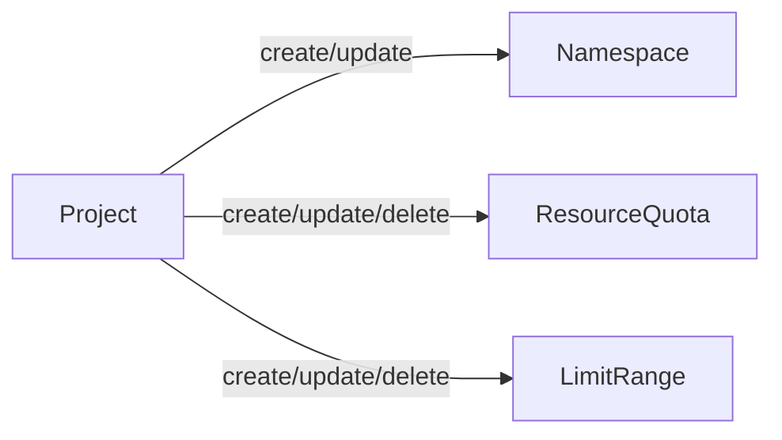
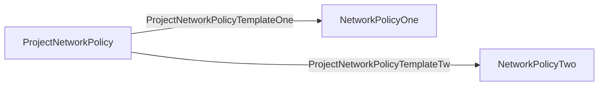
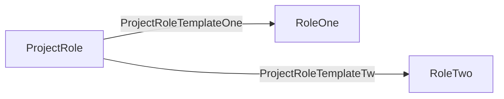

Go Project Operator







## 0. Project status badges

[](https://github.com/djkormo/go-project-operator/actions/workflows/project-operator-all.yaml)

[](https://github.com/djkormo/go-project-operator/actions/workflows/helm-chart-releaser.yaml)

[](https://github.com/djkormo/go-project-operator/actions/workflows/codeql.yaml)

## 1. Creating templates for operator

### 1.1 initialise operator framework

```bash
operator-sdk init --domain=djkormo.github.io --repo=github.com/djkormo/go-project-operator --skip-go-version-check
```

### 1.2 create Project API

```bash
operator-sdk create api --group=project --version=v1alpha1 --kind=Project --controller --resource
```

### 1.3 create ProjectNetworkPolicyTemplate API
#### skip creating controller for ProjectNetworkPolicyTemplate

```bash
operator-sdk create api --group=project --version=v1alpha1 --kind=ProjectNetworkPolicyTemplate
```
### 1.4 create ProjectNetworkPolicy API

```bash
operator-sdk create api --group=project --version=v1alpha1 --kind=ProjectNetworkPolicy --controller --resource
```
### 1.5 create ProjectRoleTemplate API
#### skip creating controller for ProjectRoleTemplate

```bash
operator-sdk create api --group=project --version=v1alpha1 --kind=ProjectRoleTemplate
```
### 1.6 create ProjectRole API

```bash
operator-sdk create api --group=project --version=v1alpha1 --kind=ProjectRole --controller --resource
```

## 2. Adding fields to our Project CRD

```yaml
apiVersion: project.djkormo.github.io/v1alpha1
kind: Project
metadata:
  name: project-sample-1
  namespace: project-operator
  labels:
    app: project-sample-label-1
  annotations:
    "co.elastic.logs/multiline.type": "true"
    "co.elastic.logs/multiline.pattern": "true"
    "co.elastic.logs/multiline.negate": "true"
    "co.elastic.logs/multiline.match": "true"
spec:
# resourceQuota
  resourceQuota:
    hard: 
      requests.cpu: "2"
      requests.memory: 3Gi
      limits.cpu: "4"
      limits.memory: 5Gi
  # limitRange  
  limitRange:
    limits:
    - max:
        memory: "30G"
        cpu: "30"
      min:
        cpu: "50m"
        memory: "50Mi"
      default:
        cpu: "200m"
        memory: "200Mi"
      defaultRequest:
        cpu: "100m"
        memory: "100Mi"
      type: Container

```
## 3. Adding fields to our Project Network Policy Template CRD
 
```yaml
apiVersion: project.djkormo.github.io/v1alpha1
kind: ProjectNetworkPolicyTemplate
metadata:
  name: projectnetpoltemplate-deny-ingress
spec:
  excludeNamespaces:
    - kube-system
    - elastic-system
    - default
  policySpec:
    podSelector:
      matchLabels: {}
    policyTypes:
    - Ingress
---
apiVersion: project.djkormo.github.io/v1alpha1
kind: ProjectNetworkPolicyTemplate
metadata:
  name: projectnetpoltemplate-deny-egress
spec:
  excludeNamespaces:
    - kube-system
    - elastic-system
    - default
  policySpec:
    podSelector:
      matchLabels: {}
    policyTypes:
    - Egress
---
apiVersion: project.djkormo.github.io/v1alpha1
kind: ProjectNetworkPolicyTemplate
metadata:
  name: projectnetpoltemplate-allow-dns
spec:
  excludeNamespaces:
    - kube-system
    - elastic-system
    - default
  policySpec:
    podSelector:
      matchLabels: {}
    policyTypes:
    - Egress
    egress:
    - to:
      - namespaceSelector:
          matchLabels:
            name: kube-system
      ports:
      - protocol: UDP
        port: 53
```

## 4. Adding fields to our Project Network Policy CRD

```yaml
apiVersion: project.djkormo.github.io/v1alpha1
kind: ProjectNetworkPolicy
metadata:
  name: projectnetpol-sample-1
  labels:
    app: project-sample-label-1
  annotations:
    "co.elastic.logs/multiline.type": "true"
    "co.elastic.logs/multiline.pattern": "true"
    "co.elastic.logs/multiline.negate": "true"
    "co.elastic.logs/multiline.match": "true"
spec:
  projectName: project-sample-1 # reference to project
  networkPolicies:
    - projectnetpoltemplate-deny-ingress
    - projectnetpoltemplate-deny-egress
    - projectnetpoltemplate-allow-dns
---
apiVersion: project.djkormo.github.io/v1alpha1
kind: ProjectNetworkPolicy
metadata:
  name: projectnetpol-sample-2
  labels:
    app: project-sample-label-2 
  annotations:
    "co.elastic.logs/multiline.type": "true"
    "co.elastic.logs/multiline.pattern": "true"
    "co.elastic.logs/multiline.negate": "true"
    "co.elastic.logs/multiline.match": "true"
spec:
  projectName: project-sample-2 # reference to project
  networkPolicies:
    - projectnetpoltemplate-deny-egress
    - projectnetpoltemplate-allow-dns

```

## 5. Change in file api/v1alpha1/project_types.go
Remove Foo field 
Add two structs for ResourceQuota and Limitrange Spec 

```go
type ProjectSpec struct {
	// INSERT ADDITIONAL SPEC FIELDS - desired state of cluster
	// Important: Run "make" to regenerate code after modifying this file

	// ResourceQuota specification
	ResourceQuota corev1.ResourceQuotaSpec `json:"resourceQuota"`
	// LimitRange specification
	LimitRange v1.LimitRangeSpec `json:"limitRange"`
}
```

## 6. Change in file api/v1alpha1/projectnetworkpolicytemplate_types.go
Remove Foo field 
Add two fields: ExcludeNamespaces and PolicySpec

```go
type ProjectNetworkPolicyTemplateSpec struct {
	// INSERT ADDITIONAL SPEC FIELDS - desired state of cluster
	// Important: Run "make" to regenerate code after modifying this file

	// Foo is an example field of ProjectNetworkPolicyTemplate. Edit projectnetworkpolicytemplate_types.go to remove/update
	ExcludeNamespaces []string                       `json:"excludeNamespaces,omitempty"`
	PolicySpec        networkingv1.NetworkPolicySpec `json:"policySpec"`
}
```


## 7. Change CRD for policy network policy

```go
type ProjectNetworkPolicySpec struct {
	// INSERT ADDITIONAL SPEC FIELDS - desired state of cluster
	// Important: Run "make" to regenerate code after modifying this file
	
	ProjectName     string   `json:"projectName,omitempty"`
	NetworkPolicies []string `json:"networkPolicies,omitempty"`
}

```


## 8. CR for Project Role Template

```yaml
apiVersion: project.djkormo.github.io/v1alpha1
kind: ProjectRoleTemplate
metadata:
  name: projectroletemplate-sample-1
rule:
  excludeNamespaces:
    - kube-system
    - elastic-system
    - default
  roleRules:
    - apiGroups:
        - ""
        - apps
        - autoscaling
        - batch
        - extensions
        - policy
        - rbac.authorization.k8s.io
        - networking.k8s.io
        - storage.k8s.io
        - metrics.k8s.io
      resources:
        - componentstatuses
        - configmaps
        - daemonsets
        - deployments
        - events
        - endpoints
        - horizontalpodautoscalers
        - ingresses
        - jobs
        - limitranges
        - namespaces
        - nodes
        - pods
        - pods/log
        - pods/exec
        - persistentvolumes
        - persistentvolumeclaims
        - resourcequotas
        - replicasets
        - replicationcontrollers
        - secrets
        - serviceaccounts
        - services
        - statefulsets
      verbs: ["*"]
```


## 9. CR for Project Role

```yaml
apiVersion: project.djkormo.github.io/v1alpha1
kind: ProjectRole
metadata:
  name: projectrole-sample-1
  labels:
    app: project-sample-label-1
    project-operator/pauseReconciliation: "false"
spec:
  projectName: project-sample-1
  roles:
    - projectroletemplate-sample-1
```

## 10. Change CRD for project role template

```go
type ProjectRoleTemplateSpec struct {
	// INSERT ADDITIONAL SPEC FIELDS - desired state of cluster
	// Important: Run "make" to regenerate code after modifying this file
	// Exclude namespaces
	ExcludeNamespaces []string `json:"excludeNamespaces,omitempty"`
	// RBAC Role Rules
	RoleRules []v1.PolicyRule `json:"roleRules,omitempty"`
}

```

## 10. Change CRD for role 

```go
type ProjectRoleSpec struct {
	// INSERT ADDITIONAL SPEC FIELDS - desired state of cluster
	// Important: Run "make" to regenerate code after modifying this file
	// Project name
	ProjectName string `json:"projectName,omitempty"`
	// Role names array
	Roles []string `json:"roles,omitempty"`
}

```


## 10. Regenerate crds and all manifests

```console
make generate
make manifests
```

## 11. Add operator logic via Reconciler Loop

```go
func (r *ProjectReconciler) Reconcile(ctx context.Context, req ctrl.Request) (ctrl.Result, error) {
	_ = log.FromContext(ctx)

	logger := log.Log.WithValues("Project operator", req.NamespacedName)

	logger.Info("Project operator Reconcile method...")

	// fetch the Project CR instance
	ProjectApp := &projectv1alpha1.Project{}
	err := r.Get(ctx, req.NamespacedName, ProjectApp)
	if err != nil {
		if errors.IsNotFound(err) {
			// Request object not found, could have been deleted after reconcile request.
			// Owned objects are automatically garbage collected. For additional cleanup logic use finalizers.
			// Return and don't requeue
			logger.Info("Project resource not found. Ignoring since object must be deleted")
			return ctrl.Result{}, nil
		}
		logger.Error(err, "Failed to get Project Operator instance")
		return ctrl.Result{}, err
	}

	return ctrl.Result{}, nil
}

```

Note! 
How to steer loop

Based on 

https://kubebyexample.com/en/learning-paths/operator-framework/operator-sdk-go/controller-reconcile-function

<pre>
The following are a few possible return options for a Reconciler:

// With the error:
return ctrl.Result{}, err

// Without an error:
return ctrl.Result{Requeue: true}, nil

// Therefore, to stop the Reconcile, use:
return ctrl.Result{}, nil

// Reconcile again after X time:
 return ctrl.Result{RequeueAfter: nextRun.Sub(r.Now())}, nil
</pre>


```console

make generate IMG="djkormo/go-project-operator:main"

make manifests IMG="djkormo/go-project-operator:main"
make build IMG="djkormo/go-project-operator:main"

make install IMG="djkormo/go-project-operator:main"

make run

```

```

bash prepare-setup.sh
make docker-build docker-push IMG=$IMG

make docker-build docker-push IMG="docker.io/djkormo/go-project-operator:v0.0.8"

```

Making helm chart stub

```
kustomize build config/default | helmify charts/go-project-operator

```
Adding helm chart release

```
git tag 0.0.1
git push origin --tags
```

Using helm chart

```
helm repo add djkormo-go-project-operator https://djkormo.github.io/go-project-operator/

helm repo update

helm search repo go-project-operator  --versions

helm install go-project-operator djkormo-go-project-operator/go-project-operator \
  --namespace project-operator --values charts/go-project-operator/values.yaml --create-namespace --dry-run

helm upgrade project-operator djkormo-go-project-operator/go-project-operator \
  --namespace project-operator --values charts/go-project-operator/values.yaml


helm uninstall go-project-operator  --namespace project-operator 

```

Testing locally
```
helm lint charts/go-project-operator

helm template charts/go-project-operator -n project-operator --values charts/go-project-operator/values.yaml
```


```console
kubectl api-resources --api-group='project.djkormo.github.io' --sort-by=kind
```

<pre>
NAME                            SHORTNAMES                                               APIVERSION
                 NAMESPACED   KIND
projects                        pr,proj                                                  project.djkormo.github.io/v1alpha1   true         Project
projectnetworkpolicies          projnetpol,prnetpol                                      project.djkormo.github.io/v1alpha1   true         ProjectNetworkPolicy
projectnetworkpolicytemplates   projectnetpoltemplate,projectnetpoltemp,projnetpoltemp   project.djkormo.github.io/v1alpha1   true         ProjectNetworkPolicyTemplate
projectroles                    projrole,prrole                                          project.djkormo.github.io/v1alpha1   true         ProjectRole
projectroletemplates            projroletemplate,projroletemp,prroletemp                 project.djkormo.github.io/v1alpha1   true         ProjectRoleTemplate
</pre>

Testing rbac 

```
kubectl auth can-i list projects --namespace project-operator  \
  --as system:serviceaccount:project-operator:controller-manager
```
<pre>
yes
</pre>

```
kubectl auth can-i list projectroletemplates --namespace project-operator  \
  --as system:serviceaccount:project-operator:project-operator:controller-manager
```
<pre>
no
</pre>

```
kubectl auth can-i list projectroles --namespace project-operator  \
  --as system:serviceaccount:project-operator:controller-manager
```
<pre>
yes
</pre>

```
kubectl auth can-i list projectnetworkpolicytemplates --namespace project-operator  \
  --as system:serviceaccount:project-operator:project-operator:controller-manager
```
<pre>
no
</pre>

```
kubectl auth can-i list projectnetworkpolicies --namespace project-operator  \
  --as system:serviceaccount:project-operator:project-operator:controller-manager
```
<pre>
no
</pre>


Literature:

https://dev.to/ishankhare07/writing-a-simple-kubernetes-controller-in-go-with-kubebuilder-ib8

https://www.techtarget.com/searchitoperations/tutorial/How-to-build-a-Kubernetes-operator


https://book.kubebuilder.io/reference/markers.html

https://github.com/programming-kubernetes


