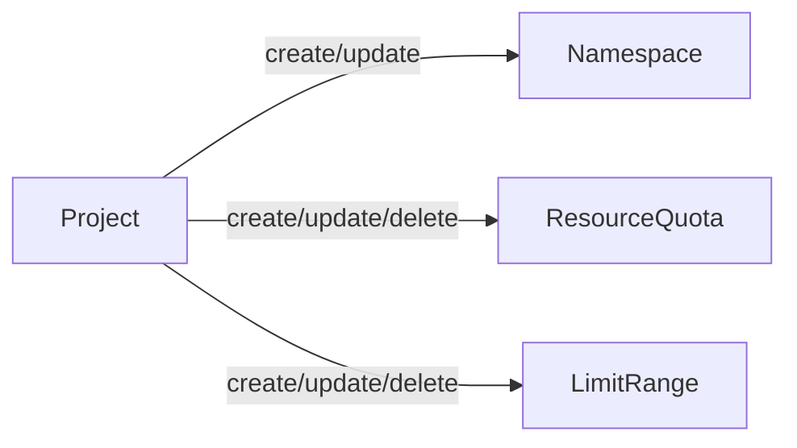

Go Project Operator



## 1. Creating template for operator

```
operator-sdk init --domain=djkormo.github.io --repo=github.com/djkormo/go-project-operator --skip-go-version-check

operator-sdk create api --group=project --version=v1alpha1 --kind=Project
```

## 2. Adding fields to our Project CRD

```yaml
apiVersion: project.djkormo.github.io/v1alpha1
kind: Project
metadata:
  name: project-sample
spec:
# resourceQuota
  resourceQuota:
    requestsCpu: "4"
    requestsMemory: 5Gi
    limitsCpu: "3"
    limitsMemory: 4Gi
  # limitRange  
  limitRange:
    maxCpu: 20000m
    maxMem: "20Gi"
    minCpu: "50m"
    minmem: "50Mi"
```
 

## 3. Change in file api/v1alpha1/project_types.go

Create two structs

```go

type ResourceQuota struct {

	// Requests for CPU
	// +kubebuilder:default:="2.5"
	RequestsCpu string `json:"requestsCpu"`

	// Requests for Memory
	// +kubebuilder:default:="1G"
	RequestsMemory string `json:"requestsMemory"`

	// Limits for CPU
	// +kubebuilder:default:="2"
	LimitsCpu string `json:"limitsCpu"`

	// Limits for Memory
	// +kubebuilder:default:="4G"
	LimitsMemory string `json:"limitsMemory"`
}

type LimitRange struct {

	// Maksimum for CPU
	// +kubebuilder:default:="2000m"
	MaxCpu string `json:"maxCpu"`

	// Maksimum for Memory
	// +kubebuilder:default:="20Gi"
	MaxMem string `json:"maxMem"`

	// Minimum for CPU
	// +kubebuilder:default:="50m"
	MinCpu string `json:"minCpu"`

	// Minimum for Memory
	// +kubebuilder:default:="50Mi"
	MinMem string `json:"minMem"`
}
```

Remowe Foo field and add pointers to the new structures

```go 

type ProjectSpec struct {
	// INSERT ADDITIONAL SPEC FIELDS - desired state of cluster
	// Important: Run "make" to regenerate code after modifying this file

	// ResourceQuota specification
	ResourceQuota *ResourceQuota `json:"resourceQuota"`
	// ResourceQuota specification
	LimitRange *LimitRange `json:"limitRange"`
}
```

```console
make generate
make manifests
```

## 4. Change in file controllers/project_controller.go

Add  missing imports

```go

"k8s.io/apimachinery/pkg/api/errors"

```

Add operator logic

```go
func (r *ProjectReconciler) Reconcile(ctx context.Context, req ctrl.Request) (ctrl.Result, error) {
	_ = log.FromContext(ctx)

	// TODO(user): your logic here
	logger := log.Log.WithValues("Project operator", req.NamespacedName)

	logger.Info("Project operator Reconcile method...")

	// fetch the Project CR instance
	ProjectApp := &projectv1alpha1.Project{}
	err := r.Get(ctx, req.NamespacedName, ProjectApp)
	if err != nil {
		if errors.IsNotFound(err) {
			// Request object not found, could have been deleted after reconcile request.
			// Owned objects are automatically garbage collected. For additional cleanup logic use finalizers.
			// Return and don't requeue
			logger.Info("Project resource not found. Ignoring since object must be deleted")
			return ctrl.Result{}, nil
		}
		logger.Error(err, "Failed to get Project Operator instance")
		return ctrl.Result{}, err
	}

	return ctrl.Result{}, nil
}
```

```console

make build

make install

make run

```

```
make docker-build docker-push IMG="djkormo/go-project-operator:main"
```

Literature:

https://dev.to/ishankhare07/writing-a-simple-kubernetes-controller-in-go-with-kubebuilder-ib8

https://www.techtarget.com/searchitoperations/tutorial/How-to-build-a-Kubernetes-operator


https://book.kubebuilder.io/reference/markers.html

https://github.com/programming-kubernetes


