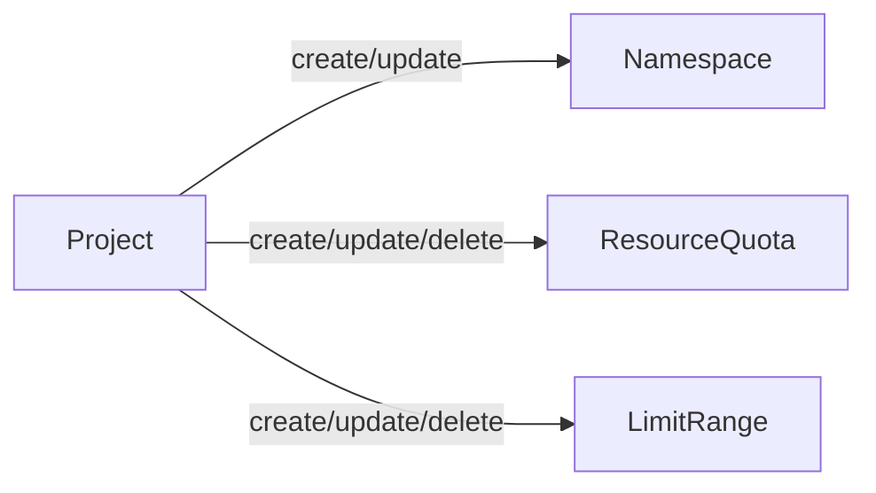

Go Project Operator



```mermaid
flowchart LR;
    ProjectNetworkPolicy--ProjectnetworkPolicyTemplateOne--create/update/delete-->NetworkPolicy-1
    ProjectNetworkPolicy--ProjectnetworkPolicyTemplateTwo--create/update/delete-->NetworkPolicy-2
```

## 1. Creating templates for operator

```
operator-sdk init --domain=djkormo.github.io --repo=github.com/djkormo/go-project-operator --skip-go-version-check

operator-sdk create api --group=project --version=v1alpha1 --kind=Project

operator-sdk create api --group=project --version=v1alpha1 --kind=ProjectNetworkPolicyTemplate

operator-sdk create api --group=project --version=v1alpha1 --kind=ProjectNetworkPolicy

```

## 2. Adding fields to our Project CRD

```yaml
apiVersion: project.djkormo.github.io/v1alpha1
kind: Project
metadata:
  name: project-sample-1
  namespace: project-operator
  labels:
    app: project-sample-label-1
  annotations:
    "co.elastic.logs/multiline.type": "true"
    "co.elastic.logs/multiline.pattern": "true"
    "co.elastic.logs/multiline.negate": "true"
    "co.elastic.logs/multiline.match": "true"
spec:
# resourceQuota
  resourceQuota:
    hard: 
      requests.cpu: "2"
      requests.memory: 3Gi
      limits.cpu: "4"
      limits.memory: 5Gi
  # limitRange  
  limitRange:
    limits:
    - max:
        memory: "30G"
        cpu: "30"
      min:
        cpu: "50m"
        memory: "50Mi"
      default:
        cpu: "200m"
        memory: "200Mi"
      defaultRequest:
        cpu: "100m"
        memory: "100Mi"
      type: Container

```
## 3. Adding fields to our Project Network Policy Template CRD
 
```yaml
apiVersion: project.djkormo.github.io/v1alpha1
kind: ProjectNetworkPolicyTemplate
metadata:
  name: projectnetpoltemplate-deny-ingress
spec:
  excludeNamespaces:
    - kube-system
    - elastic-system
    - default
  policySpec:
    podSelector:
      matchLabels: {}
    policyTypes:
    - Ingress
---
apiVersion: project.djkormo.github.io/v1alpha1
kind: ProjectNetworkPolicyTemplate
metadata:
  name: projectnetpoltemplate-deny-egress
spec:
  excludeNamespaces:
    - kube-system
    - elastic-system
    - default
  policySpec:
    podSelector:
      matchLabels: {}
    policyTypes:
    - Egress
---
apiVersion: project.djkormo.github.io/v1alpha1
kind: ProjectNetworkPolicyTemplate
metadata:
  name: projectnetpoltemplate-allow-dns
spec:
  excludeNamespaces:
    - kube-system
    - elastic-system
    - default
  policySpec:
    podSelector:
      matchLabels: {}
    policyTypes:
    - Egress
    egress:
    - to:
      - namespaceSelector:
          matchLabels:
            name: kube-system
      ports:
      - protocol: UDP
        port: 53
```


## 4. TODO Adding fields to our Project Network Policy CRD

```yaml
apiVersion: project.djkormo.github.io/v1alpha1
kind: ProjectNetworkPolicy
metadata:
  name: projectnetpol-sample-1
  labels:
    app: project-sample-label-1
  annotations:
    "co.elastic.logs/multiline.type": "true"
    "co.elastic.logs/multiline.pattern": "true"
    "co.elastic.logs/multiline.negate": "true"
    "co.elastic.logs/multiline.match": "true"
spec:
  projectName: project-sample-1
  networkPolicies:
    - projectnetpoltemplate-deny-ingress
    - projectnetpoltemplate-deny-egress
    - projectnetpoltemplate-allow-dns
---
apiVersion: project.djkormo.github.io/v1alpha1
kind: ProjectNetworkPolicy
metadata:
  name: projectnetpol-sample-2
  labels:
    app: project-sample-label-2
  annotations:
    "co.elastic.logs/multiline.type": "true"
    "co.elastic.logs/multiline.pattern": "true"
    "co.elastic.logs/multiline.negate": "true"
    "co.elastic.logs/multiline.match": "true"
spec:
  projectName: project-sample-2
  networkPolicies:
    - projectnetpoltemplate-deny-egress
    - projectnetpoltemplate-allow-dns

```

## 5. Change in file api/v1alpha1/project_types.go
Remove Foo field 
Add two structs for ResourceQuota and Limitrange Spec 

```go
type ProjectSpec struct {
	// INSERT ADDITIONAL SPEC FIELDS - desired state of cluster
	// Important: Run "make" to regenerate code after modifying this file

	// ResourceQuota specification
	ResourceQuota corev1.ResourceQuotaSpec `json:"resourceQuota"`
	// LimitRange specification
	LimitRange v1.LimitRangeSpec `json:"limitRange"`
}
```

## 6. Change in file api/v1alpha1/projectnetworkpolicytemplate_types.go
Remove Foo field 
Add two fields: ExcludeNamespaces and PolicySpec

```go
type ProjectNetworkPolicyTemplateSpec struct {
	// INSERT ADDITIONAL SPEC FIELDS - desired state of cluster
	// Important: Run "make" to regenerate code after modifying this file

	// Foo is an example field of ProjectNetworkPolicyTemplate. Edit projectnetworkpolicytemplate_types.go to remove/update
	ExcludeNamespaces []string                       `json:"excludeNamespaces,omitempty"`
	PolicySpec        networkingv1.NetworkPolicySpec `json:"policySpec"`
}
```


## 7. TODO Change crd for policy network policy

## 8. Regenerate crds and all manifests

```console
make generate
make manifests
```

## 9. Add operator logic via Reconciler Loop

```go
func (r *ProjectReconciler) Reconcile(ctx context.Context, req ctrl.Request) (ctrl.Result, error) {
	_ = log.FromContext(ctx)

	logger := log.Log.WithValues("Project operator", req.NamespacedName)

	logger.Info("Project operator Reconcile method...")

	// fetch the Project CR instance
	ProjectApp := &projectv1alpha1.Project{}
	err := r.Get(ctx, req.NamespacedName, ProjectApp)
	if err != nil {
		if errors.IsNotFound(err) {
			// Request object not found, could have been deleted after reconcile request.
			// Owned objects are automatically garbage collected. For additional cleanup logic use finalizers.
			// Return and don't requeue
			logger.Info("Project resource not found. Ignoring since object must be deleted")
			return ctrl.Result{}, nil
		}
		logger.Error(err, "Failed to get Project Operator instance")
		return ctrl.Result{}, err
	}

	return ctrl.Result{}, nil
}
```

```console

make generate IMG="djkormo/go-project-operator:main"

make manifests IMG="djkormo/go-project-operator:main"
make build IMG="djkormo/go-project-operator:main"

make install IMG="djkormo/go-project-operator:main"

make run

```

```
make docker-build docker-push IMG="djkormo/go-project-operator:main"
```

Making helm chart

```
kustomize build config/default | helmify chart
```

Literature:

https://dev.to/ishankhare07/writing-a-simple-kubernetes-controller-in-go-with-kubebuilder-ib8

https://www.techtarget.com/searchitoperations/tutorial/How-to-build-a-Kubernetes-operator


https://book.kubebuilder.io/reference/markers.html

https://github.com/programming-kubernetes


